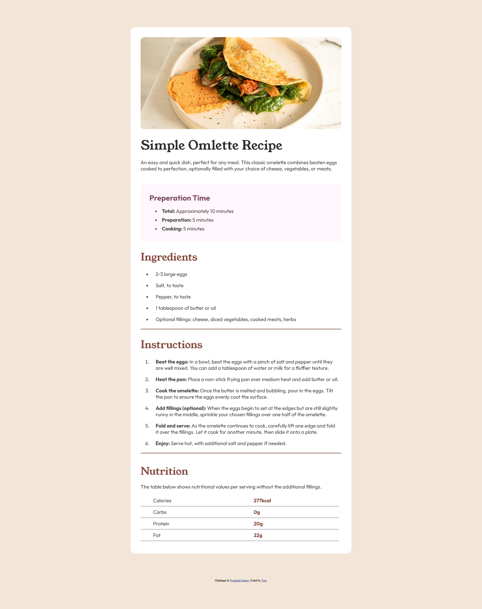

# Frontend Mentor - Recipe page solution

This is a solution to the [Recipe page challenge on Frontend Mentor](https://www.frontendmentor.io/challenges/recipe-page-KiTsR8QQKm). Frontend Mentor challenges help you improve your coding skills by building realistic projects. 

## Table of contents

- [Overview](#overview)
  - [The challenge](#the-challenge)
  - [Screenshot](#screenshot)
  - [Links](#links)
- [My process](#my-process)
  - [Built with](#built-with)
  - [What I learned](#what-i-learned)
  - [Continued development](#continued-development)
  - [Useful resources](#useful-resources)
- [Author](#author)
- [Acknowledgments](#acknowledgments)

## Overview

### The challenge

I wanted to refresh my CSS skills after a long time without coding any HTML or CSS as well as start wokring through the Frontend Mentor full challanges list, so chose this to start with.

### Screenshot

### Links

- Solution URL: [Add solution URL here](https://your-solution-url.com)
- Live Site URL: [Add live site URL here](https://your-live-site-url.com)

## My process

### Built with

- Semantic HTML5 markup
- CSS custom properties
- Flexbox
- Mobile-first workflow

### What I learned

This was just a quick refresher to HTML and CSS since it's been so long.

### Continued development

Will look into refreshing my JavaScript knowledge before picking up the Odin Project from where I left off.

### Useful resources

- [ChatGPT](https://www.example.com) - ChatGPT is amazing for asking questions,

## Author

- Frontend Mentor - [@tg-ivy](https://www.frontendmentor.io/profile/yourusername)
- Github - [tg-ivy](https://github.com/tg-ivy)

## Acknowledgments

- Frontend Mentor
- ChatGPT
